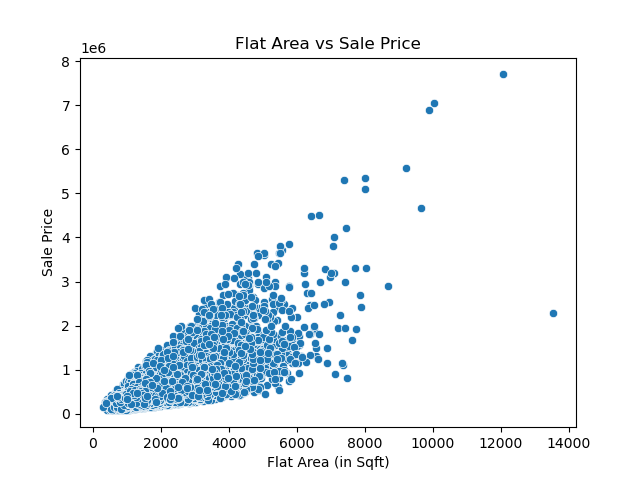
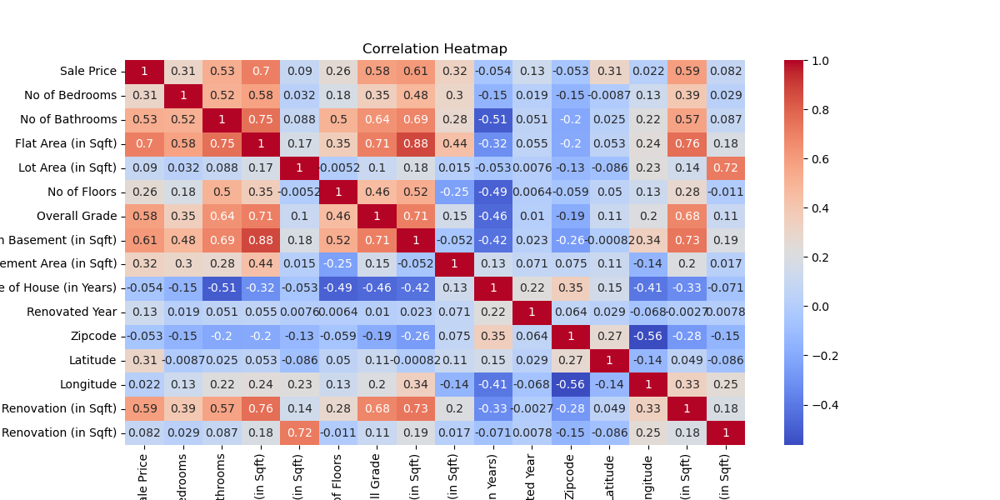
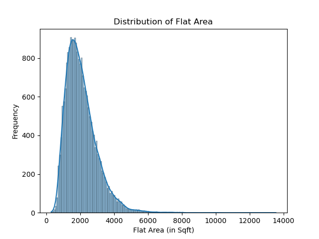
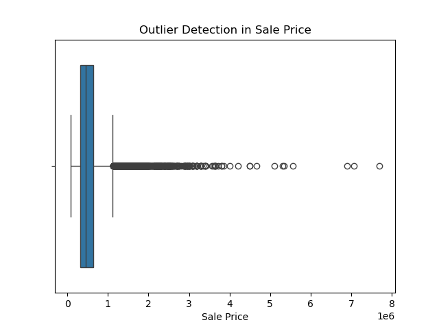
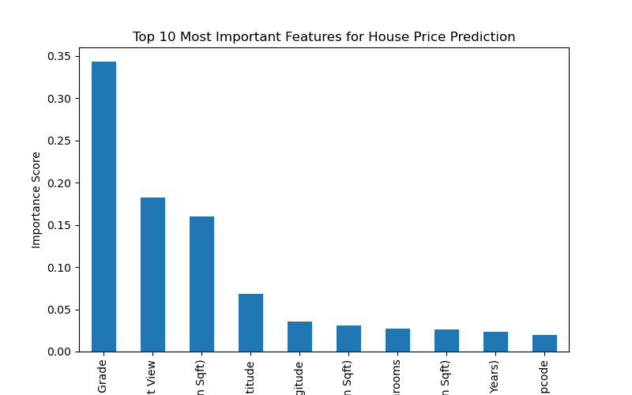

# House Price Prediction using Machine Learning

## Project Overview
This project builds a **machine learning model to predict house prices** using various property features such as house size, number of bedrooms, location, and overall house quality.

Multiple machine learning algorithms were trained and compared to determine the best model for predicting house sale prices.

---

## Problem Statement
House price prediction is an important task in real estate analytics.  
The goal of this project is to **predict house sale prices based on property characteristics** using machine learning techniques.

This model can help:
- Real estate agencies
- Property buyers
- Property sellers
- Investment analysts

make better data-driven decisions.

---

## Dataset
The dataset contains approximately **21,000 housing records** with several features describing each property.

### Important Features

- Number of Bedrooms
- Number of Bathrooms
- Flat Area (in Sqft)
- Lot Area (in Sqft)
- Number of Floors
- Overall Grade
- Basement Area
- Age of House
- Latitude and Longitude (Location)

### Target Variable

**Sale Price**

---

## Machine Learning Workflow

The project follows a standard **machine learning pipeline**:

1. Business Problem Understanding  
2. Data Loading  
3. Data Cleaning  
4. Handling Missing Values  
5. Exploratory Data Analysis (EDA)  
6. Feature Engineering  
7. Train-Test Split  
8. Model Training  
9. Model Evaluation  
10. Hyperparameter Tuning  
11. Model Comparison  
12. Final Model Selection  

---

## Machine Learning Models Used

The following models were implemented and evaluated:

- Linear Regression
- Decision Tree Regressor
- Random Forest Regressor
- Tuned Random Forest (GridSearchCV)
- XGBoost Regressor

---

## Best Model

The **XGBoost Regressor** achieved the best performance among all tested models.

### Model Performance

| Metric | Value |
|------|------|
| R² Score | 0.886 |
| Mean Absolute Error (MAE) | 65,590 |
| Root Mean Squared Error (RMSE) | 128,539 |

---

## Key Insights

Feature importance analysis showed that the following features had the highest impact on house prices:

- Flat Area
- Overall Grade
- Location (Latitude & Longitude)
- Number of Bathrooms
- Living Area after Renovation

---

# Project Visualizations

### Sale Price Distribution

---

### Flat Area vs Sale Price

---

### Distribution of Flat Area

---

### Sale Price Outliers

---

### Feature Importance

---

# Project Structure
